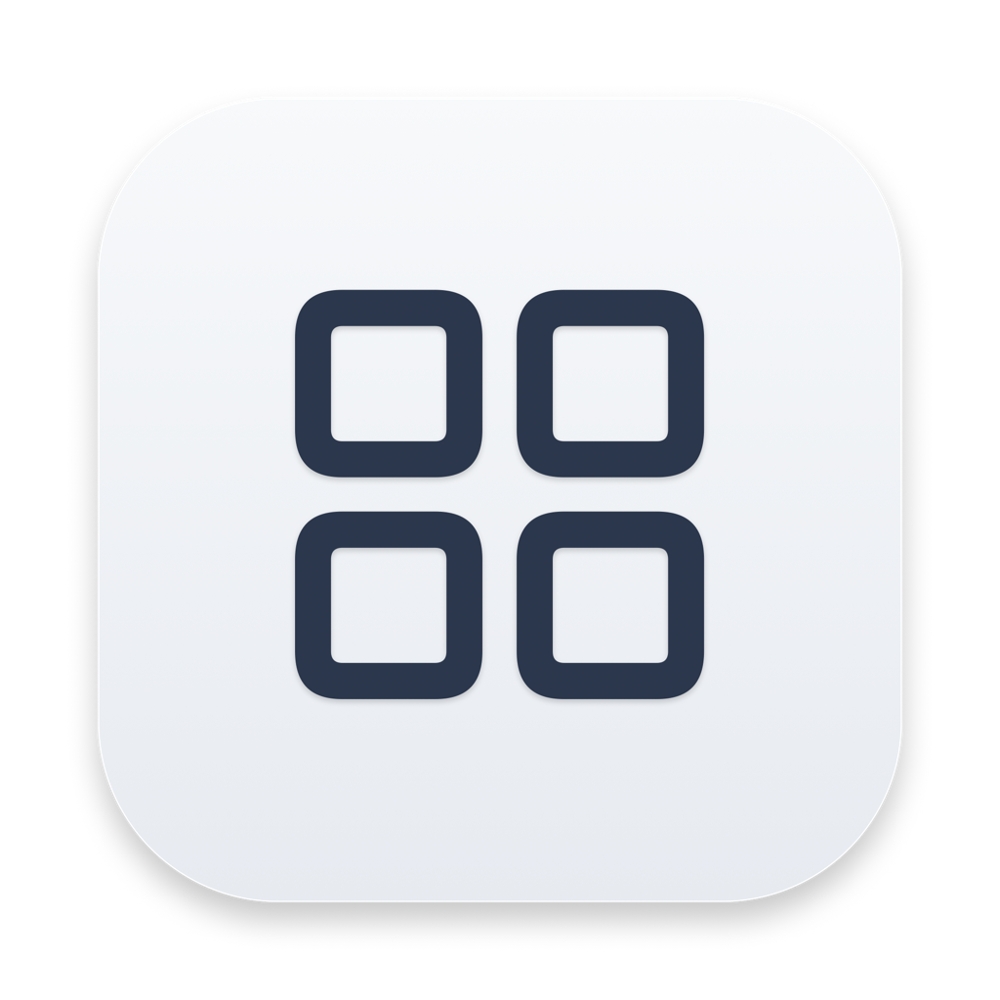
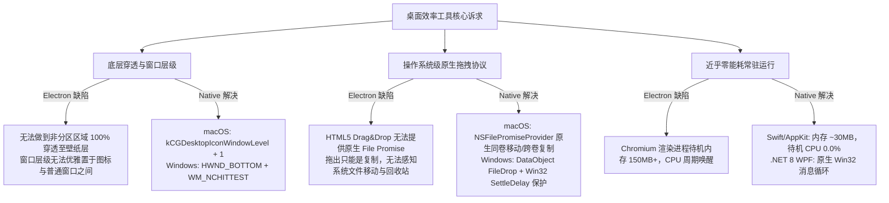
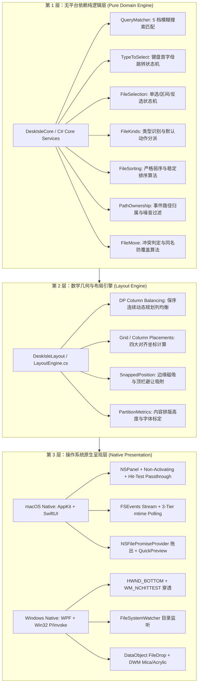
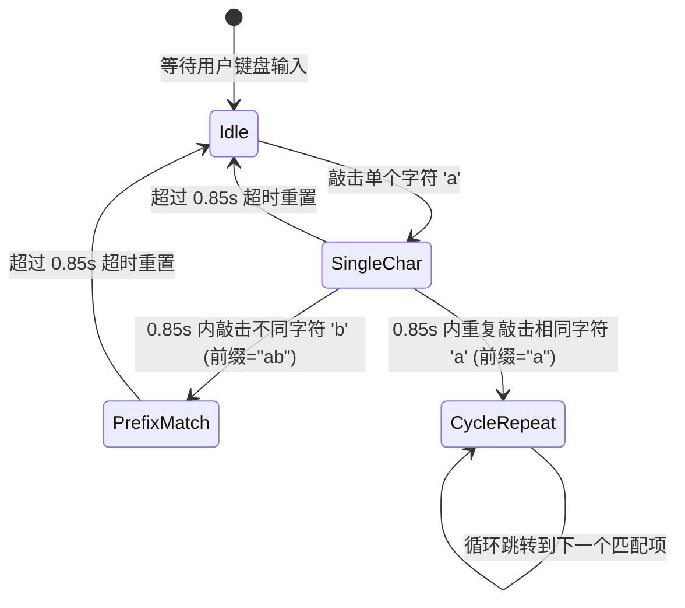

# 🏝️ DeskIsle 桌岛

> **从 0 到 1 构建的极简优雅桌面分区收纳与效率管家 · 架构设计与工程实现指南**  
> *Spatial Island Metaphor · Native Desktop Integration · Near-Zero Idle Cost · Cross-Platform Concurrency*

<div align="center">
  
  <p><strong>桌面秩序浮岛 · 顶端灵动中枢</strong></p>
  <p>毫秒级文件映射 · 原生系统底层穿透 · 全屏无缝隔离 · 0.0% 待机能耗</p>
  <p>
    
    
    
    
    
  </p>
</div>

---

> [!IMPORTANT]
> **本文档是从零构建（0 到 1）视角编写的全项目唯一权威工程规范与说明文档**，涵盖 macOS 原生端与 Windows 原生端。
> 
> - **macOS 原生版（`mac/`）是唯一基线**：新特性首先在 macOS 端落地验证，Windows 端（`windows/`）以此为准绳进行算法与行为对齐。
> - **两端同源共享契约**：严格遵循同一套统一间距常数（`margin=16`, `gap=16`）、相对屏坐标口径与 Schema v3 配置规范。
> - **全环境测试护栏**：macOS 端配备 179 项自动化测试；Windows 核心逻辑经由跨平台链接编译，在 macOS 开发机上即可通过 .NET 8 运行 102 项单元测试，配合 `scripts/crosscheck/run.sh` 实行 15 组布局场景逐点对拍。

---

## 📖 目录

1. [🌟 项目愿景与问题定义 (From 0 to 1)](#1-项目愿景与问题定义)
   - [1.1 桌面收纳的本质痛点](#11-桌面收纳的本质痛点)
   - [1.2 为什么必须是原生：从 Electron 到 Native 的抉择](#12-为什么必须是原生从-electron-到-native-的抉择)
   - [1.3 核心设计哲学：浮岛隐喻与零能耗常驻](#13-核心设计哲学浮岛隐喻与零能耗常驻)
2. [🏛️ 总体系统架构与分层设计](#2-总体系统架构与分层设计)
   - [2.1 三层解耦架构蓝图](#21-三层解耦架构蓝图)
   - [2.2 跨端契约与数据规范](#22-跨端契约与数据规范)
   - [2.3 领域模型与可测性设计](#23-领域模型与可测性设计)
3. [🛠️ 从零构建与本地开发指南](#3-从零构建与本地开发指南)
   - [3.1 环境要求与依赖](#31-环境要求与依赖)
   - [3.2 macOS 原生版构建、打包与测试](#32-macos-原生版构建打包与测试)
   - [3.3 Windows 原生版跨平台编译与测试](#33-windows-原生版跨平台编译与测试)
   - [3.4 跨端布局算法对拍套件](#34-跨端布局算法对拍套件)
4. [🧩 核心功能系统与工程实现](#4-核心功能系统与工程实现)
   - [4.1 映射文件夹浮岛 (Portal Isle)](#41-映射文件夹浮岛-portal-isle)
   - [4.2 待办清单浮岛 (Todo Isle)](#42-待办清单浮岛-todo-isle)
   - [4.3 随手便签浮岛 (Notes Isle)](#43-随手便签浮岛-notes-isle)
   - [4.4 浮岛空间窗口系统 (Spatial Window Engine)](#44-浮岛空间窗口系统-spatial-window-engine)
   - [4.5 顶端灵动中枢与全局效率工具 (Island Dock & Global Tools)](#45-顶端灵动中枢与全局效率工具-island-dock--global-tools)
5. [📐 数学布局引擎与列平衡算法](#5-数学布局引擎与列平衡算法)
   - [5.1 四大对齐模式与几何规范](#51-四大对齐模式与几何规范)
   - [5.2 动态规划保序列均衡算法 (DP Column Balancing)](#52-动态规划保序列均衡算法-dp-column-balancing)
   - [5.3 镜像反射与读序解耦定理](#53-镜像反射与读序解耦定理)
6. [🛡️ 可靠性、容灾与防陷阱工程](#6-可靠性容灾与防陷阱工程)
   - [6.1 原子落盘、.bak 副本与 20 份滚动快照](#61-原子落盘bak-副本与-20-份滚动快照)
   - [6.2 Schema v3 幂等迁移](#62-schema-v3-幂等迁移)
   - [6.3 生产级踩坑与防回归守则 (Engineering Battles)](#63-生产级踩坑与防回归守则-engineering-battles)
7. [📋 完整功能对齐矩阵与速查手册](#7-完整功能对齐矩阵与速查手册)
   - [7.1 macOS ↔ Windows 全功能对齐矩阵](#71-macos--windows-全功能对齐矩阵)
   - [7.2 全局热键与交互手势速查](#72-全局热键与交互手势速查)
   - [7.3 已下线功能复盘（避坑记录）](#73-已下线功能复盘避坑记录)

---

## 1. 项目愿景与问题定义

### 1.1 桌面收纳的本质痛点

计算机桌面原本被设计为工作记忆的延伸，但在日常高强度生产力场景中，桌面迅速退化为「临时文件垃圾场」：
1. **真实文件杂乱无章**：文件随机堆放，遮挡壁纸且查找困难；传统文件夹又需要反复双击窗口钻取，流程割裂。
2. **割裂的工作流组件**：用户往往需要在桌面、Finder/资源管理器、待办软件、随手记事本之间频繁切换窗口。
3. **传统桌面整理软件的笨拙**：如传统栅格工具占用大量后台常驻内存、界面设计陈旧、强行接管桌面甚至破坏操作系统原生快捷键与壁纸交互。

### 1.2 为什么必须是原生：从 Electron 到 Native 的抉择

DeskIsle 在最初期曾探索过基于 Web/Electron 的跨平台方案，但在深度迭代中发现了 Web 技术栈在桌面底层基础设施上的**物理极限**：



因此，DeskIsle 彻底移除了 Electron 方案，坚定确立了 **macOS Native（Swift/AppKit/SwiftUI）+ Windows Native（.NET 8/WPF/Win32）** 双原生路线，并建立起严格的架构分层。

### 1.3 核心设计哲学：浮岛隐喻与零能耗常驻

- **浮岛隐喻（Spatial Isle）**：将传统刻板的文件窗口解构成散落在桌面壁纸上的毛玻璃浮岛，具有连续曲率圆角与微妙的微距阴影。
- **100% 桌面穿透（Desktop Penetration）**：非分区区域完全对鼠标事件透明，点击直接穿透至系统桌面，不阻挡壁纸交互、不拦截桌面右键菜单、不影响系统图标选择框。
- **顶端灵动中枢（Island Dock）**：屏幕顶部悬浮胶囊状工具栏，按屏幕独立自适应宽度，承载创建、搜索、布局对齐与快速控制。
- **纯粹开箱（Zero-Pollution Out-of-the-Box）**：首次安装不预置任何无意义的演示数据，给用户一张完全纯净的桌面。

---

## 2. 总体系统架构与分层设计

### 2.1 三层解耦架构蓝图

为确保 macOS 与 Windows 双端在交互逻辑、数学运算、排版几何上 100% 严丝合缝，同时最大化利用各自平台的原生 UI 渲染优势，DeskIsle 采用了清晰的三层分层架构：



### 2.2 跨端契约与数据规范

为实现配置在两端之间无损备份、迁移与跨平台导入，系统确立了三大硬契约：

#### 1. 统一几何间距契约
- **屏幕外边距**：`margin = 16`
- **分区间距**：`gap = 16`
- **磁吸阈值**：`snapThreshold = 12`
- **顶栏吸附余量**：吸附顶栏时保留 `topMargin = 16` 避让空间

#### 2. 相对屏坐标体系
所有分区的坐标 `(x, y)` 均**以其所属显示器的可用工作区（VisibleFrame / WorkingArea）左上角为相对原点**，并附带该屏标识 `screenId`。多屏拖动时，在跨越屏幕边界的瞬间重算相对坐标并更新 `screenId`。

#### 3. 规范 Schema v3 与键名收敛准绳
macOS 端为**唯一规范写入端**，Windows 端支持规范写入并对历史键名提供只读兼容：

| 语义 | 规范键名（macOS 基线写入） | Windows 历史兼容只读键 |
|---|---|---|
| 边缘磁吸 | `snapToEdges` | `edgeSnapping` |
| 折叠悬停展开 | `hoverPeekCollapsed` | `hoverPreview` |
| 全局显隐快捷键 | `globalShortcut` | `globalHotkey` |
| 全局搜索快捷键 | `searchShortcut` | `searchHotkey` |
| 自动收件开关 | `autoIngest` | `enabled` |
| 递归扫描 | `recursive` | `includeSubfolders` |
| 最大显示项数 | `maxCount` | `limit` |

#### 4. 分区高度口径契约

尺寸相关的常数**不允许散落在调用点**，两端各自只有一处实现（mac `DeskIsleLayout/PartitionMetrics`、Windows `Services/PartitionMetrics.cs`）。改视图侧 padding / 行高，必须回头同步这里的标定值：

| 语义 | 键名 / 函数 | 取值范围 | 说明 |
|---|---|---|---|
| 分区默认高度 | `defaultPartitionHeight` | `[140, 本屏可用高 − 60]` | 新建分区的初始高度 |
| 分区最小高度 | `minPartitionHeight` | `[140, 本屏可用高 − 60]` | 自适应与拖边缩放的下限；**未显式设置时跟随「默认高度」**，老配置免迁移 |
| 高度夹取 | `clampedPartitionHeight` / `ClampedPartitionHeight` | 同上 | 两个高度偏好**共用一条口径**，否则会出现「最小 990 / 默认 5000」的自相矛盾 |
| 窗口高度 | `windowHeight` / `WindowHeight` | `clamp(标题栏44 + 内容, 下限, 可用高−60)` | 自适应只能用这一个口径，历史上调用方手抄公式导致「单测覆盖的和实际跑的不是同一条分支」 |

- **内外两个下限取较大值**：渲染物理底线（mac 150 / Windows 140）与用户偏好 —— 用户只能把下限往上抬，压不到 100，不会把分区压坏。
- **拖边缩放的下限跟随该设置**（mac 原硬编码 64、Windows XAML 原 `MinHeight=40`，设了 300 照样能拖成 40）；**折叠态降回 44**，否则折叠窗口会被下限撑开。

**跨端布局差异（勿互抄）**：mac 的 portal 有网格 / 列表两种真实布局，自适应**按 `viewMode` 分派**（`gridContentHeight` / `listContentHeight`，`listRowHeight = 28`）；Windows 端**只有列表一种布局**（「网格」按钮只切换字形、不改 `ItemsPanel`），恒定用 `ListContentHeight`。同理，mac 待办条目会折成两行（按实测字宽判定，半角 7.2 / 全角 12.9），Windows 待办是 `TextTrimming=CharacterEllipsis` 单行截断，不做折行补偿。

### 2.3 领域模型与可测性设计

在 macOS 端，由于 SwiftPM 的可执行 Target（`executableTarget`）无法直接被测试 Target（`testTarget`）导入，项目特意将全部纯计算业务下沉为两个独立的静态类库：
- [`DeskIsleCore`](file:///Users/yang/Documents/myself/DeskIsle/mac/Sources/DeskIsleCore)：状态机、选择判据、文件类型、搜索打分。
- [`DeskIsleLayout`](file:///Users/yang/Documents/myself/DeskIsle/mac/Sources/DeskIsleLayout)：几何排列、DP 均衡分组算法、自适应尺寸标定。

在 Windows 端，为了能够在非 Windows 系统（如开发机 macOS、Linux CI）上直接执行 `dotnet test`，测试工程 [`DeskIsle.Tests`](file:///Users/yang/Documents/myself/DeskIsle/windows/tests/DeskIsle.Tests/DeskIsle.Tests.csproj) 采用标准 `net8.0`（而非 `net8.0-windows`），通过 MSBuild 链接编译（`Compile Include ... Link`）拉取与主工程完全同源的无 UI 依赖核心类库。

---

## 3. 从零构建与本地开发指南

### 3.1 环境要求与依赖

- **macOS 构建**：macOS 14.0+，Xcode 15.0+（含命令行工具 Command Line Tools），Swift 5.9+。无任何外部 CocoaPods 或 Carthage 依赖。
- **Windows 构建**：Windows 10 1809+ / Windows 11，.NET 8.0 SDK。
- **macOS 开发机交叉调试 Windows 测试**：已安装用户级 .NET 8 SDK（`~/.dotnet`）。

### 3.2 macOS 原生版构建、打包与测试

```bash
# 1. 运行核心算法与状态机测试套件（179 条断言）
swift test --package-path mac

# 2. 编译 Debug 版本并本地运行
swift build --package-path mac
./mac/.build/debug/DeskIsle

# 3. 生产发布打包（编译 Release、构建 .app 包裹、签名、集成中文本地化）
bash mac/build-app.sh

# 4. 运行打包好的原生应用
open mac/dist/DeskIsle.app
```

> [!NOTE]
> `mac/build-app.sh` 会自动检测钥匙串中名为 `DeskIsle` 的自签证书进行代码签名。若无证书则自动退回至 ad-hoc 签名。建议开发者生成一张自签名证书，可避免每次重新打包后系统辅助功能与输入监听权限被重置。

### 3.3 Windows 原生版跨平台编译与测试

由于配置了跨平台 MSBuild 靶向与链接测试套件，**Windows 原生核心代码在 macOS 上亦可完成全量编译与单测**：

```bash
# 配置 .NET 环境变量
export DOTNET_ROOT="$HOME/.dotnet"
export PATH="$HOME/.dotnet:$PATH"

# 编译 Windows 整体工程（验证无语法与类型错误）
dotnet build windows/DeskIsle.sln -v minimal

# 执行 Windows 跨平台测试套件（102 项单元测试）
dotnet test windows/tests/DeskIsle.Tests/DeskIsle.Tests.csproj
```

在 Windows 物理机上，可直接使用批处理或发布命令：
```cmd
windows\build.bat
:: 产物输出于 windows\dist\DeskIsle\DeskIsle.exe
```

### 3.4 跨端布局算法对拍套件

为保证双端排版算法在像素级完全吻合，项目设立了自动化对拍脚本：

```bash
bash scripts/crosscheck/run.sh
```

**运行原理**：
1. 编译运行 macOS 真实实现 Target `CrosscheckDump`，输出 15 个复杂场景下的计算 JSON。
2. 运行 Windows `LayoutEngine.cs` 的全真直译 Python 脚本，生成对应场景计算 JSON。
3. 对拍脚本逐个比对坐标、列高与分组结果，判定两端算法逻辑是否保持 100% 绝对一致。

---

## 4. 核心功能系统与工程实现

DeskIsle 桌面生态围绕三大核心分区类型与两大全局效率组件构建：

```
DeskIsle 系统全景
 ├── 映射文件夹 (Portal Isle) ── 真实文件系统双向映射、快速预览、原生解压、即时键盘跳转
 ├── 待办清单 (Todo Isle)     ── 快速捕获、完成徽章药丸、自适应行高、文件拖入绑定
 ├── 随手便签 (Notes Isle)    ── 纯文本记事、URL/IP 智能高亮直达、全中文右键菜单、TXT 导出
 ├── 空间窗口引擎 (Spatial Window) ── 8向伸缩、底层穿透、顶栏磁吸、0.2s平滑折叠、多屏隔离
 └── 灵动中枢 (Island Dock)  ── 顶部胶囊导航、5档模糊全局搜索、命名布局预设
```

---

### 4.1 映射文件夹浮岛 (Portal Isle)

映射文件夹是 DeskIsle 最具特色的收纳形态：**它不是虚拟的收藏列表，而是操作系统真实目录的高性能交互窗口**。

#### 1. 实时文件系统监控：FSEvents 与 mtime 轮询结合
- **主通道：FSEvents 递归订阅**：
  为每个映射根目录建立一条带有 `FileEvents` 标志的 `FSEventStream`。为防止底层高频 IO 拖垮 UI（例如用户在目录下运行 `git checkout` 或 `npm install`），采用两道过滤防护：
  1. **路径所有权过滤（`PathOwnership.affectsListing`）**：只有事件路径属于当前分区正在浏览的目录层级时，才触发视图刷新；深层无关目录直接忽略。
  2. **0.2 秒事件防抖合流（Debounce）**：将密集触发的多条底层文件系统事件合并为单次批量刷新。
- **兜底通道：3 节拍轻量级轮询**：
  在网络挂载盘（SMB/NFS）或不支持 FSEvents 的特殊外置介质中，自动启用 2 秒级轻量 `stat` 探测，并在 30 秒周期对文件大小与修改时间进行指纹校验，确保外部改动绝不漏网。

#### 2. 键盘即时跳转 (Type-to-Select) 与动态网格导航
无需手动打开搜索框，聚焦分区后直接在键盘打字即可快速定位：
- **前缀智能累加**：输入 `d` 跳转到以 `d` 开头的文件；0.85 秒内继续输入 `o`，自动累加前缀为 `do` 并精准匹配 `document`。
- **单字符循环切换**：若连续敲击同一字母（如 `ddd`），系统在所有以 `d` 开头的文件间循环轮替聚焦。
- **动态列宽方向键导航**：内置算法根据容器实时物理像素宽度动态计算当前实际呈现列数（`columns`），上下左右方向键在二维网格与一维列表中实现自然的几何跳转。



#### 3. 选区状态机与文件管理交互
- **现代选区逻辑**：单击项即选中、⌘/Ctrl 多选加选、⇧ 区间选择、单击空白区域清空选区。
- **跨分区隔离**：操作 A 分区时，B 分区的已有选中态保持高亮，互不影响。
- **原生操作键位**：支持 `⌘C`/`⌘X`/`⌘V` 复制剪切粘贴、`⌘⌫` 移入废纸篓、`↩`/`F2` 行内重命名、`空格` 预览。
- **独立应用剪贴板（`FileClipboard`）**：内部复制剪切不污染系统 Finder 剪贴板，剪切后粘贴完成立即销毁，严防重贴丢失数据。

#### 4. 归档解压与轻量快速预览 (QuickPreview)
- **双击动作智能分派**：双击图片自动调用内置无损浮层；双击文件夹就地展开面包屑导航；双击常规文件交由系统默认程序。
- **原生解压缩与防散落设计**：
  内置原生解压引擎，支持 `zip`、`tar`、`gz`、`tgz` 等归档格式。
  - **单根目录检测**：解压前先探测包内文件结构；若包内文件散落无根目录，**自动创建同名文件夹包裹**，彻底根除桌面文件散落灾难。
  - **快速预览显式解压按钮**：选中压缩包按空格或调起 QuickPreview 时，顶部提供高亮「解压缩到当前目录」动作，异步无阻塞解压并即时刷新当前视图。
- **QuickPreview 交互细节**：预览面板使用 `.nonactivatingPanel` 窗口层级，绝不强抢系统 Key 焦点，关闭后平滑淡出，不打乱分区的置顶层级状态。

#### 5. 跨应用原生拖拽与同名防冲突
- **真实原生拖出（Native Drag-Out）**：
  集成 macOS `NSFilePromiseProvider` 与 Windows `DataObject(DataFormats.FileDrop)`，向系统外发出真实的文件对象引用（而非死板的路径字符串）。拖向访达或其他盘符时，系统自动裁决**同卷移动 / 跨卷复制**。
- **防误触层级高亮指示**：
  拖拽文件移入分区时，精准判定鼠标落点是「当前分区空白底板」还是「某个子文件夹」。当悬停在子文件夹上时，**仅高亮该子条目**，与整区边框高亮严格互斥，杜绝误拖入深层目录。
- **同名冲突三选一对话框**：
  当拖入或粘贴遇到同名文件时，弹出标准对话框提供明确选项：
  - **保留两者**（默认回车）：自动按操作系统惯例追加 ` 2`、` 3` 后缀。
  - **替换**：原子删除旧文件并落位新文件。
  - **停止**：安全取消并保留剪贴板原状态。

---

### 4.2 待办清单浮岛 (Todo Isle)

待办清单专为高频碎片化任务而生：

- **极简捕获体验**：顶部常驻回车新建任务输入栏，支持设置 1/2/3 级优先级、标签与截止备注。
- **智能完成度徽章 (Badge Pill)**：
  标题栏动态呈现 `完成数 / 总数`（如 `3/8`）。当全部待办完成时，徽章自动切换为醒目的**翡翠绿胶囊药丸**（Green Pill），给予清晰的正向激励。
- **精准内容高度自适应**：
  双击分区底边或点击自适应按钮时，系统按 `标题栏 44pt + 顶部输入栏 + 项数 × 单项高度 + 内边距` 计算精确数学尺寸，消除多余空白与内部滚动条。
  长文本条目是否折行，按**实测字宽**判定（mac 半角 7.2pt / 全角 12.9pt）——早年按「字符数 ÷ 13」估算，只对中文碰巧成立，英文条目会被误判成折行、每条多算 16pt。
- **文件拖拽绑定**：外部文件直接拖拽扔进待办分区，自动提取文件名并创建关联待办条目。

---

### 4.3 随手便签浮岛 (Notes Isle)

随手便签提供如同实体便签贴在桌面的随手记录体验：

- **排版参数精密标定**：采用系统原生排版引擎进行文字边界计算（macOS 13pt 系统字体，标定行高 16pt，字宽 7.2pt；Windows Segoe UI 标定行高 16px）。
- **智能正则探测**：自动识别文本中的 **URL 网页链接**与 **IPv4 网络地址（支持端口号）**，高亮下划线并在按住修饰键点击时直达系统浏览器或终端。
- **全中文原生上下文菜单**：
  针对 macOS 默认右键菜单杂乱且英文混杂的问题，重写了 `NotesTextView` 右键逻辑，实现 100% 汉化菜单并提供专属快捷动作：
  - 📋 **拷贝全文**：一键将整篇便签拷入剪贴板。
  - 🗑️ **清空便签**：二次确认后重置文本内容。
  - 💾 **导出为 TXT**：快速将便签另存为外部文本文件。

---

### 4.4 浮岛空间窗口系统 (Spatial Window Engine)

#### 1. 窗口层级魔法与全屏让位机制

```
屏幕显示纵深层级 (Z-Index Hierarchy)
 ┌──────────────────────────────────────────┐
 │  顶层：全局模态弹窗 / 系统菜单 (TopMost)      │
 ├──────────────────────────────────────────┤
 │  高层：普通应用程序窗口 (Browser, IDE, Office) │
 ├──────────────────────────────────────────┤
 │  ★ 置顶浮岛 (.floating / HWND_TOPMOST)    │
 ├──────────────────────────────────────────┤
 │  ★ 未置顶浮岛 (DesktopIconLevel + 1)      │  <-- DeskIsle 核心栖息层
 ├──────────────────────────────────────────┤
 │  底层：系统桌面图标 (Desktop Icons)        │
 ├──────────────────────────────────────────┤
 │  基底：系统壁纸 (Wallpaper)               │
 └──────────────────────────────────────────┘
```

- **未置顶状态**：窗口定位于 `kCGDesktopIconWindowLevel + 1`（Windows 下为 `HWND_BOTTOM`）。当用户打开全屏应用或切换全屏 Space 时，浮岛自动避让在后，绝不突兀遮挡全屏工作区。
- **置顶状态**：提升至 `.floating` 级别，赋予 `[.canJoinAllSpaces, .fullScreenAuxiliary]` 属性，跟随所有虚拟桌面穿梭。

#### 2. 100% 桌面穿透与连续曲率命中测试
浮岛背景基于超椭圆（Squircle）连续曲率算法构建。本地与全局鼠标监视器协同判定：当且仅当鼠标指针落入分区圆角几何边界之内时激活交互；圆角外区域 100% 将事件穿透回系统桌面。

#### 3. 8 向自由伸缩与边缘双击
- 4 条边框与 4 个拐角均支持平滑拖拽缩放，悬停显示系统拉伸光标。
- **双击底边 / 右下角**：直接触发「内容高度自适应」（底边仅调高度、保留宽度；右下角同时把宽度重置为标准宽度）。
- **双击标题栏**：进入行内重命名模式（限制最大 10 个字符）。

#### 4. 智能边缘磁吸与顶栏避让吸附 (Snapped Position)
- 自由拖拽分区时，在距屏幕边缘或相邻分区 **12px** 阈值内产生自然磁力吸附。
- **顶栏下沿对齐避让**：靠近顶部悬浮顶栏底边时，系统自动计入 `topMargin = 16`，保证吸附时不与顶栏重叠。
- **按住 Option / Alt**：临时跳过磁力吸附，实现像素级自由摆放。

#### 5. 平滑折叠动画与悬停展开 (Hover Peek)
- **0.20 秒 Ease-In-Out 动画**：双击折叠按钮时，窗口高度在 0.2 秒内平滑过渡，仅收敛为 44pt 高度的精致胶囊条。
- **悬停临时预览**：鼠标悬停在已折叠的分区标题栏上超过 200ms，浮岛自动展开展示完整内容；鼠标移开后自动收拢。

#### 6. 全链路操作锁定机制
点击锁形按钮或按屏锁定时，全链路拦截**拖动、缩放、双击自适应、折叠、删除**等所有改变布局的操作，并提供瞬时优雅 Toast 提示，防止日常使用误触打乱桌面。

#### 7. 尺寸偏好与自适应契约

全局偏好「分区默认高度」同级提供「分区最小高度」。自适应的行为**按入口名字约定**，绝不隐式越权：

| 入口 | 宽度 | 折叠态 |
|---|---|---|
| 标题栏「自适应**宽高**」、双击右下角 | 重置为标准宽度 | 展开 |
| 双击底边 | **保留**（只调高度） | 展开 |
| 设置面板「按内容自适应高度」按钮 | **保留** | 展开 |
| 「所有分区自适应高度」批量菜单 | **保留** | **保持折叠** |
| 切换网格 ⇄ 列表后自动重算 | **保留** | **保持折叠** |
| 分区设置面板保存（未手动改高度时） | **保留** | **保持折叠** |

- **判据只有一句**：名字里带「宽」才重置宽度；**只有用户显式点自适应的入口才展开折叠分区**。
  批量菜单曾误传 `resetWidth: true`，一次操作把用户手工拖好的宽度全抹平；而批量自适应若展开折叠分区，等于把「折叠省地方」的意图一次性推翻。
- 保持折叠时只更新**存储的展开高度**（下次展开即生效），屏幕上的窗口维持 44pt，位置夹取也按实际显示高度算。
- **自适应后夹回屏幕**：高度变化会同步把 `x / y` 收进本屏工作区（Windows 端此前只改高度，靠近底边的分区长高后会掉出工作区）。

---

### 4.5 顶端灵动中枢与全局效率工具 (Island Dock & Global Tools)

#### 1. 自适应胶囊顶栏
每块显示器顶部独立悬挂一条胶囊导航条，随按钮增减自适应计算宽度。提供新建分区、全局搜索、一键排版对齐、显隐切换与设置入口。

#### 2. 五档模糊全局搜索打分引擎 (`QueryMatcher`)
集成独立全局热键 `⌥⌘F`（Windows 为 `Alt+F`），调起统一搜索窗口，一次查询并发检索**所有映射文件夹文件、待办条目与便签文本**：
```
打分优先级：
1. 绝对精确匹配 (Exact Match)
2. 单词前缀匹配 (Prefix Match)
3. 连续子串匹配 (Substring Match)
4. 紧凑子序列匹配 (Tight Subsequence)
5. 宽松子序列匹配 (Loose Subsequence)
```
搜索命中后提供一键打开、在访达中显示或直接定位并高亮闪烁目标浮岛。

#### 3. 屏幕感知命名布局预设 (Layout Presets)
支持将特定显示器上所有浮岛的相对坐标、尺寸与排列模式保存为命名快照（如「沉浸编程模式」、「文档整理模式」），支持多套快照一键平滑还原。

---

## 5. 数学布局引擎与列平衡算法

DeskIsle 的核心排版算法位于独立的 [`DeskIsleLayout`](file:///Users/yang/Documents/myself/DeskIsle/mac/Sources/DeskIsleLayout) 模块与 Windows `LayoutEngine.cs`。

### 5.1 四大对齐模式与几何规范

| 模式标识 | 名称 | 排布特征 | 入口位置 |
|---|---|---|---|
| `top` | **顶部横向排序** | 列优先、严格阶梯式高度均衡降序、宽度范围内尽量多列 | 顶栏对齐按钮 |
| `left` | **左侧纵向对齐** | 严格贴左、最少列数纵向长列对齐 | 顶栏对齐按钮 |
| `right` | **右侧纵向对齐** | `left` 的严格几何镜像反射，最少列数贴右对齐 | 顶栏对齐按钮 |
| `grid` | **网格平铺自适应** | 行优先网格，自左向右均匀平铺换行 | 托盘菜单高级项 |

---

### 5.2 动态规划保序列均衡算法 (DP Column Balancing)

传统贪心算法在分区高度参差不齐时极易出现「末列饿死」或各列高低剧烈波动的缺陷。DeskIsle 采用了**基于动态规划的三键字典序保序分组算法**：

```
动态规划目标最小化字典序三元组：
cost(P) = (极差 Range, 方向违例 Direction Violations, 高度平方和 Sum of Squares)
```

1. **定列数**：
   - 对于 `top` 模式：先取 `min(分区数, maxColumns)`，并以 `minimumFeasibleColumnCount(availH)` 向上顶起（**高度超限时加列**），再逐级校验总宽向下夹紧，确保每一列的高度均不超出屏幕可视边界。
   - 对于 `left` / `right` 模式：计算在每列不超过可用高度前提下的**最少列数**。
2. **状态转移设计**：
   为了准确计算极差与方向违例，状态必须感知前一列的起止边界。DP 状态定义为 `(列数 k, 本组起点 i, 本组终点 j)`，在 $O(k \cdot n^3)$ 时间内求得绝对最优解。
3. **降序阶梯摆开（`top` 模式专属）**：
   分组求解完成后，各列按实际列高从高到矮降序排布，形成视觉上赏心悦目的阶梯感。

```
真实 7 分区排版列高对比 (高度: 316, 150, 150, 150, 314, 428, 610)
  传统网格 (极差 626):  | 942 | 942 | 316 | 316 | 316 |
  顶部对齐 (极差 294):  | 610 | 480 | 428 | 316 | 316 |  <-- 严格无断层阶梯
```

---

### 5.3 镜像反射与读序解耦定理

在工程实现中，曾经历过关于「右侧对齐列高是递增还是递减」的重大数学论证：
> ⚠️ **数学互斥定理**：在几何坐标系中，**严格的左右镜像反射，必然导致右侧对齐的物理高度自左向右递增**。
> 若强行要求右侧对齐也「自左向右递减」，就必须解出两套不同的 DP 分组，从而彻底破坏左右镜像对称性。

DeskIsle 确立了**保镜像原则**：
- `right` 模式被严格定义为 `left` 的几何反射：
  $$X_{\text{right}} = \text{Screen Width} - X_{\text{left}} - \text{Width}$$
- **读序解耦法则**：
  - `left` / `right` 模式由当前浮岛「贴靠哪一侧」决定读序来源，保证连点幂等。
  - `top` 模式的列在空间上已按高矮重排，其实体几何顺序已不再代表读序，因此 `top` 模式**固定以配置存储顺序为稳定输入**，杜绝连点二次漂移。

---

## 6. 可靠性、容灾与防陷阱工程

作为一个常驻桌面且承载用户真实文件的底层管家，数据安全与运行健壮性被置于最高优先级。

### 6.1 原子落盘、.bak 副本与 20 份滚动快照

为防御系统突发断电、磁盘满或进程异常崩溃导致配置损坏，DeskIsle 实现了三级容灾防护网：


- **原子重命名**：配置先全量写入临时文件，调用底层文件系统 `rename` 原子覆盖，防止产生半截损坏的 JSON。
- **备份副本 `.bak`**：主配置文件写入完成后，同步更新 `.bak` 镜像。当主文件读取解析失败时，自动无缝切至备份还原。
- **滚动 20 份历史快照**：配置修改时自动在 `history/` 目录留存快照，提供「一分钟内至多生成一份」的防高频节流阀。用户可在设置面板随时一键还原历史任意版本。

### 6.2 Schema v3 幂等迁移

系统配置文件内置版本号字段 `schemaVersion`（当前为 **3**）。
- **字段向后兼容原则**：新增字段均设为 Optional 并在模型层提供合理兜底默认值。
- **幂等迁移流水线**：
  - `v1 -> v2`：引入 `screenId`，将屏幕绝对坐标平滑换算为相对屏坐标。
  - `v2 -> v3`：将遗留分区类型自动清理，将顶层键名归一化收敛。
  - 迁移过程只打版本戳、不强行挪动已有数据结构，保证老版本与新版本数据格式无缝过渡。

### 6.3 生产级踩坑与防回归守则 (Engineering Battles)

#### 坑 1：窗口整窗拖动与内部条目拖出的死锁
- **现象**：开启 AppKit 的 `isMovableByWindowBackground = true` 后，用户尝试拖拽列表中的文件时，窗口跟着鼠标满屏幕飞，文件根本无法拖出。
- **根因**：系统窗口管理器的背景拖动判定优先级高于 SwiftUI / WPF 内部的鼠标事件处理。
- **治理规范**：强制设置 `isMovableByWindowBackground = false`。仅在窗口顶部 44pt 标题栏区域允许拖动，且严格扣除右侧按钮区域；同时设置 3pt 鼠标位移阈值，避免轻微手抖将按钮点击误判为窗口拖动。

#### 坑 2：AppKit 倒置坐标系与全局鼠标监视器漂移
- **现象**：在多显示器排列复杂的 Mac 上，浮岛的鼠标穿透判定发生严重偏移。
- **根因**：AppKit 原生坐标系以主屏左下角为 `(0, 0)` 且 Y 轴向上，而 `CGDisplayBounds` 与全局鼠标事件坐标系以主屏左上角为 `(0, 0)` 且 Y 轴向下。
- **治理规范**：在 [`PartitionPanel.swift`](file:///Users/yang/Documents/myself/DeskIsle/mac/Sources/DeskIsle/PartitionPanel.swift) 中统一建立屏幕坐标转换流水线，所有命中测试与磁吸判定均在归一化局部坐标系中完成。

#### 坑 3：应用内独立剪贴板与系统访达剪贴板互串
- **现象**：在浮岛内剪切了文件，去访达粘贴时意外将文件落到了外部；或在访达复制了文本，在浮岛内粘贴却删除了原文件。
- **治理规范**：彻底禁用系统共享剪贴板，构建进程级单例 [`FileClipboard`](file:///Users/yang/Documents/myself/DeskIsle/mac/Sources/DeskIsle/FileOperations.swift)，剪贴操作严格自闭环。

#### 坑 4：拖拽文件误入子文件夹灾难
- **现象**：用户本意是将文件拖入分区当前目录，鼠标划过某个子文件夹条目时松手，文件悄然钻入深层子目录造成「文件离奇丢失」。
- **治理规范**：引入严格互斥的高亮指示状态机。当鼠标精确悬停在某个子文件夹条目上时，仅该条目展现深色包围盒，整区边框高亮立即熄灭；松手后 Toast 提示展示完整落点路径。

---

## 7. 完整功能对齐矩阵与速查手册

### 7.1 macOS ↔ Windows 全功能对齐矩阵

| 功能模块 | 详细能力项 | macOS 原生版 | Windows 原生版 | 契约与对齐规范 |
|---|---|:---:|:---:|---|
| **核心分区形态** | 映射文件夹 (Portal Isle) | ✅ | ✅ | 真实目录映射，面包屑导航，网格/列表视图切换 |
| | 待办清单 (Todo Isle) | ✅ | ✅ | 回车新建、优先级、完成药丸徽章（`X/Y`）、外部文件拖入 |
| | 随手便签 (Notes Isle) | ✅ | ✅ | 纯文本、URL/IPv4 高亮直达、全中文右键菜单、导出 TXT |
| **文件交互系统** | 键盘即时跳转 (Type-to-Select) | ✅ | ✅ | 前缀智能累积、同键循环、二维方向键动态列跳转 |
| | 原生拖拽移出 (Drag-Out) | ✅ | ✅ | 发出真实文件引用，同卷移动/跨卷复制 |
| | 原生拖拽移入 (Drag-In) | ✅ | ✅ | 支持子文件夹高亮互斥，同名三选一防覆盖 |
| | 归档快速解压 (Unarchive) | ✅ | ✅ | ZIP/TAR/GZ/TGZ 原生解压，单根目录检测防散落 |
| | 快速预览 (QuickPreview) | ✅ | ✅ | 空格/双击图片轻量浮层预览，不抢夺系统 Key 焦点 |
| **窗口与空间管理** | 8 向伸缩与自适应高度 | ✅ | ✅ | 边缘拖拽伸缩（下限跟随「分区最小高度」），双击底边自适应内容高度，自适应后夹回本屏工作区 |
| | 分区默认 / 最小高度偏好 | ✅ | ✅ | 同键名 `defaultPartitionHeight` / `minPartitionHeight`，共用 `[140, 可用高−60]` 夹取；最小高度未设置时跟随默认高度 |
| | 自适应折叠策略 | ✅ | ✅ | 仅显式入口展开折叠分区，批量 / 隐式触发保持折叠 |
| | 桌面穿透与分级层级 | ✅ | ✅ | 底层穿透、全屏应用自动让位、置顶切换 |
| | 边缘磁吸与顶栏避让 | ✅ | ✅ | 靠近四边及顶栏自动吸附对齐（`snappedPosition`） |
| | 平滑折叠动画与悬停预览 | ✅ | ✅ | 0.20s Ease-In-Out 折叠过渡动画，悬停展开 (Hover Peek) |
| | 全链路防误触锁定 | ✅ | ✅ | 锁定拖动/缩放/重命名，拦截并弹出友好 Toast |
| **多显示器支持** | 按屏独立管理 | ✅ | ✅ | 每屏独立顶栏、独立显隐、独立对齐模式、多屏热插拔感知 |
| | 相对屏坐标体系 | ✅ | ✅ | 坐标相对于所属屏，统一使用 `screenId` 挂载 |
| **全局效率工具** | 顶端灵动中枢 (TopBar) | ✅ | ✅ | 胶囊状自适应宽度导航条，按屏独立挂载 |
| | 全局搜索 (Global Search) | ✅ | ✅ | 跨分区文件/待办/便签检索，五档模糊匹配打分 |
| | 命名布局预设 (Presets) | ✅ | ✅ | 按屏保存位置尺寸快照，一键还原任意布局 |
| **数据与工程安全** | 原子落盘与 .bak 备份 | ✅ | ✅ | 临时文件覆写 + 备份副本双重保障 |
| | 滚动 20 份历史快照 | ✅ | ✅ | 防频繁保存节流门控，一键快速回滚 |
| | Schema 统一幂等迁移 | ✅ (v3) | ✅ (v3) | 规范键名收敛，自动向上平滑迁移 |

---

### 7.2 全局热键与交互手势速查

#### 1. 全局系统级快捷键
| 操作 | macOS 默认组合 | Windows 默认组合 | 说明 |
|---|---|---|---|
| **显示 / 隐藏分区** | `⌘ + ⌥ + D` | `Alt + D` | 独立注册槽位，可在设置中重新录入 |
| **全局快速搜索** | `⌘ + ⌥ + F` | `Alt + F` | 跨分区五档模糊搜索 |

#### 2. 分区内部常用键盘快捷键（焦点位于映射文件夹内且不在输入框）
| 快捷键 | 功能 | 说明 |
|---|---|---|
| `⌘A` / `Ctrl + A` | **全选** | 选中当前目录所有文件与目录 |
| `Esc` | **清空选择** | 仅在有选中项时拦截并取消；无选中时自然冒泡 |
| `⌘C` / `Ctrl + C` | **复制** | 存入应用内专用剪贴板（不污染系统剪贴板） |
| `⌘X` / `Ctrl + X` | **剪切** | 一次性剪切，粘贴成功后自动销毁 |
| `⌘V` / `Ctrl + V` | **粘贴** | 粘贴至当前浏览目录（遇同名弹出三选一对话框） |
| `⌘⌫` / `Delete` | **移入废纸篓** | 走系统回收站协议，不做不可逆物理粉碎 |
| `↩` 或 `F2` | **重命名** | 仅选中单项时触发，行内就地编辑 |
| `空格` | **快速预览** | 预览图片或弹出压缩包解压操作浮层 |
| `↑` / `↓` / `←` / `→` | **网格导航** | 按实际列宽几何跳转选中项 |
| 任意字母字符 | **即时跳转** | 0.85s 前缀累积检索或同键循环跳转 |

#### 3. 鼠标交互与手势
| 手势操作 | 触发位置 | 产生的行为响应 |
|---|---|---|
| **按住拖动** | 仅限标题栏 44pt 区域 | 移动分区位置（越过 3pt 阈值后启动位移） |
| **双击文字** | 分区标题栏标题文本 | 启动行内重命名编辑框（最长 10 汉字） |
| **双击按钮** | 标题栏折叠按钮 | 触发 0.20s 平滑收缩至 44pt 或展开至原始高度 |
| **鼠标悬停** | 已折叠的分区标题栏 | 临时展开预览完整内容，移开后恢复收起 |
| **双击边界** | 底边边框或右下角角标 | 触发基于文本与项数精密测算的内容高度自适应：底边**保留宽度**，右下角同时重置宽度；折叠中的分区顺势展开 |
| **边缘拉伸** | 4 条边框或 4 个拐角 | 启动 8 向自由交互缩放 |
| **拖拽时按住 Option / Alt** | 任意正在拖动的分区 | 临时屏蔽所有边缘与相邻分区磁力吸附 |
| **右键空白处** | 映射文件夹底板 | 调出空白菜单：新建文件夹、粘贴、全选、在访达中打开、立即刷新 |
| **右键便签内** | 便签文本视图 | 调出全中文菜单：拷贝全文、清空便签、导出为 TXT |

---

### 7.3 已下线功能复盘（避坑记录）

在 DeskIsle 从 0 到 1 的演进历程中，曾有一批特性因经过深度实践验证发现存在体验缺陷或架构违和而被果断移除。记录于此以供镜鉴：

| 被下线功能 | 移除时间 | 为什么果断移除 | 架构反思与沉淀 |
|---|---|---|---|
| **Electron 跨平台技术栈** | 2026-10-01 | 无法实现底层穿透；HTML5 拖出缺少真实文件移动回调；常驻内存高达 150MB+。 | 确立了 Native 方案作为桌面底层效率工具的不可动摇地位。 |
| **文件收集箱（`collection`）** | 2026-10-01 | 「只登记引用、不搬移文件」的逻辑聚合概念与「分区即真实目录」的认知模型强冲突。引用失效清理逻辑臃肿。 | 将收纳哲学收敛为单一强心智模型：**分区即真实磁盘目录**。遗留配置在读盘时由 `RemovedPartition` 幂等静默剔除。 |
| **智能规则归类箱（`smart`）** | 2026-10-01 | 缺乏真实高频落地场景，规则匹配在复杂工作流下极易造成意外文件移动。 | 保持产品极简克制，去除不成熟的过度自动化设计。 |
| **桌面空白处右键菜单接管** | 2026-09-29 | 抢占桌面系统全局事件破坏原生 macOS/Windows 操作习惯，引起用户困惑。 | 确立「绝不污染和抢夺系统原生桌面交互」的核心原则。 |
| **Windows 死代码 `BalanceColumns`** | 2026-09-30 | 历史上残留的贪心 2-Opt 搜索算法从未被实际调用，且与 macOS 列式 DP 不对齐。 | 统一由双端同源的保序 DP 均衡算法接管。 |

---

<div align="center">
  <sub>🏝️ DeskIsle · 让桌面重归平静、秩序与美感</sub><br />
  <sub>Zero-to-One Architectural Engineering Guide · Single Source of Truth</sub>
</div>
